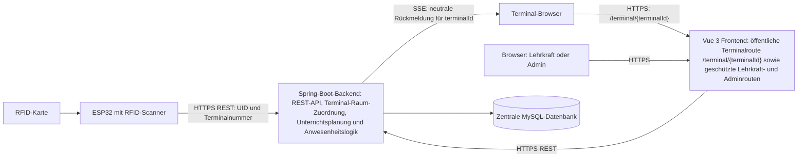

# Systemarchitektur

## Festgelegte Verantwortlichkeiten

- Der ESP32 liest die RFID-UID und sendet sie mit fest konfigurierter Terminalnummer per HTTPS. Die Terminalnummer ist kein Gerätegeheimnis.
- Das Backend bestimmt den Raum ausschließlich aus `Terminalnummer → Raum` und prüft anschließend Planung, Klasse, Zeitpunkt und Statusregeln.
- Die Terminalansicht ist die öffentliche Vue-Route `/terminal/{terminalId}`. Sie zeigt ausschließlich neutrale SSE-Rückmeldungen für diese Terminal-ID.
- Die Vue-SPA nutzt dieselben serverseitig geschützten REST-Schnittstellen für Lehrkraft- und Adminfunktionen.
- Die zentrale MySQL-Datenbank enthält mehrere Tabellen. Rohscans und fachliche Anwesenheiten bleiben getrennt.

## Grundlage

- [#15 – Projekt-Setup](https://github.com/fes-wiesbaden/p4-gr5_schuelerzeiterfassung/issues/15): Spring Boot, Vue, MySQL, nginx und öffentliche Vue-Terminalroute.
- [#18 – Datenmodell](https://github.com/fes-wiesbaden/p4-gr5_schuelerzeiterfassung/issues/18): getrennte Rohscan- und Anwesenheitsdaten.
- [#24 – Terminal-/Raum-Identifikation](https://github.com/fes-wiesbaden/p4-gr5_schuelerzeiterfassung/issues/24), [#26 – Scan-Endpunkt](https://github.com/fes-wiesbaden/p4-gr5_schuelerzeiterfassung/issues/26) und [#29 – RFID-Hardware](https://github.com/fes-wiesbaden/p4-gr5_schuelerzeiterfassung/issues/29): HTTPS-Scan und Terminal-Raum-Zuordnung.
- [#30 – Unterrichtseinheit & Scanvalidierung](https://github.com/fes-wiesbaden/p4-gr5_schuelerzeiterfassung/issues/30) und [#31 – Anwesenheit & Status](https://github.com/fes-wiesbaden/p4-gr5_schuelerzeiterfassung/issues/31): zentrale Geschäftslogik.
- [#34 – Vue-SPA](https://github.com/fes-wiesbaden/p4-gr5_schuelerzeiterfassung/issues/34) und [#37 – Terminalansicht](https://github.com/fes-wiesbaden/p4-gr5_schuelerzeiterfassung/issues/37): Weboberfläche und SSE-Feedback.
