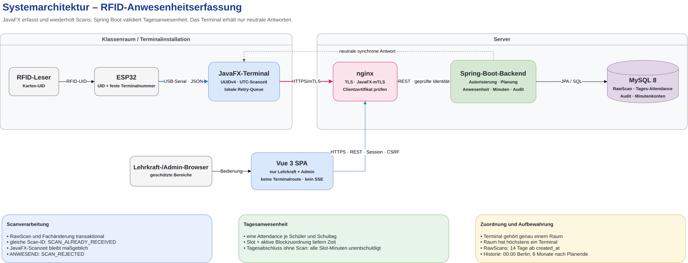

# Systemarchitektur

## Festgelegte Verantwortlichkeiten

- `nginx` ist der HTTPS-Einstiegspunkt. Für ESP32-Scans prüft es das feste ESP32-Client-Zertifikat gegen die Client-CA und leitet nur mTLS-geprüfte Anfragen an das Backend weiter.
- [[[Der ESP32 liest die RFID-UID und sendet UID, stabile `scanId` und feste Terminalnummer.]]] Er synchronisiert seine Zeit vor jedem HTTPS-Scan per NTP und prüft das Serverzertifikat gegen die lokale Server-CA. `WiFiClientSecure.setInsecure()` ist verboten.
- Beim Wechsel des Test-Laptops werden WLAN-IP, HTTPS-Ziel und lokale Server-CA in der ESP32-Test-Firmware aktualisiert. Client-Zertifikat und privater Schlüssel des ESP32 bleiben unverändert.
- [[[Das Spring-Boot-Backend ist die alleinige Instanz für Autorisierung, Raumauflösung, Planung, Scanvalidierung, Anwesenheit, Verspätung und Aufbewahrung. Der Serverzeitpunkt ist beim Scan maßgeblich.]]]
- [[[Das Backend löst den Raum ausschließlich über `Terminalnummer → Raum` auf. Es bestimmt anschließend aus Zeit, Stundenplan, Blockzuordnung und Unterrichtseinheit die aktuelle Klasse.]]]
- Die Vue-SPA enthält die öffentliche Terminalroute `/terminal/{terminalId}` sowie geschützte Lehrkraft- und Adminbereiche. REST-Aufrufe sind serverseitig durch Sitzung, CSRF-Schutz und [[[Rollen-/Klassenrechte]]] abgesichert.
- [[[Die Terminalansicht erhält über `GET /api/terminals/{terminalnummer}/events` nur neutrale SSE-Rückmeldungen. UID, Name, Geburtsdatum, Klasse und Anwesenheitsdetails dürfen dort nie erscheinen.]]]
- [[[MySQL speichert Rohscans getrennt von Anwesenheiten und Audits. Rohscans werden nach 14 Tagen gelöscht; Stundenpläne, Blockpläne, Unterrichtseinheiten, Anwesenheiten und Audits sechs Monate nach Schuljahresende.]]]
- [[[`student.birth_date` ist Stammdaten- und ERM-Scope. Es erfordert keine neue Architekturkomponente und wird nicht an das Terminal übertragen.]]]

## Architektur-relevante Issues

- [#15 – Projekt-Setup](https://github.com/fes-wiesbaden/p4-gr5_schuelerzeiterfassung/issues/15), [#24 – Terminal-/Raum-Identifikation](https://github.com/fes-wiesbaden/p4-gr5_schuelerzeiterfassung/issues/24), [#26 – Scan-Endpunkt](https://github.com/fes-wiesbaden/p4-gr5_schuelerzeiterfassung/issues/26) und [#29 – RFID-Hardware](https://github.com/fes-wiesbaden/p4-gr5_schuelerzeiterfassung/issues/29): HTTPS, mTLS, NTP, Scan-ID und [[[Terminal-Raum-Zuordnung.]]]
- [[[#18 – Datenmodell](https://github.com/fes-wiesbaden/p4-gr5_schuelerzeiterfassung/issues/18) und [#21 – RFID-UIDs & Datenaufbewahrung](https://github.com/fes-wiesbaden/p4-gr5_schuelerzeiterfassung/issues/21): Datenmodell, getrennte Rohscans und Aufbewahrung.]]]
- [#22 – Login & Session-Sicherheit](https://github.com/fes-wiesbaden/p4-gr5_schuelerzeiterfassung/issues/22) und [[[#23 – Rollen & Klassenrechte](https://github.com/fes-wiesbaden/p4-gr5_schuelerzeiterfassung/issues/23): Berechtigungsprüfung.]]]
- [[[#30 – Unterrichtseinheit & Scanvalidierung](https://github.com/fes-wiesbaden/p4-gr5_schuelerzeiterfassung/issues/30) und [#31 – Anwesenheit & Status](https://github.com/fes-wiesbaden/p4-gr5_schuelerzeiterfassung/issues/31): zentrale Fachlogik.]]]
- [#34 – Vue-SPA](https://github.com/fes-wiesbaden/p4-gr5_schuelerzeiterfassung/issues/34), [#37 – Terminalansicht](https://github.com/fes-wiesbaden/p4-gr5_schuelerzeiterfassung/issues/37) und [#43 – Live-Anwesenheit via SSE](https://github.com/fes-wiesbaden/p4-gr5_schuelerzeiterfassung/issues/43): Routen, Terminal-Feedback und SSE.
